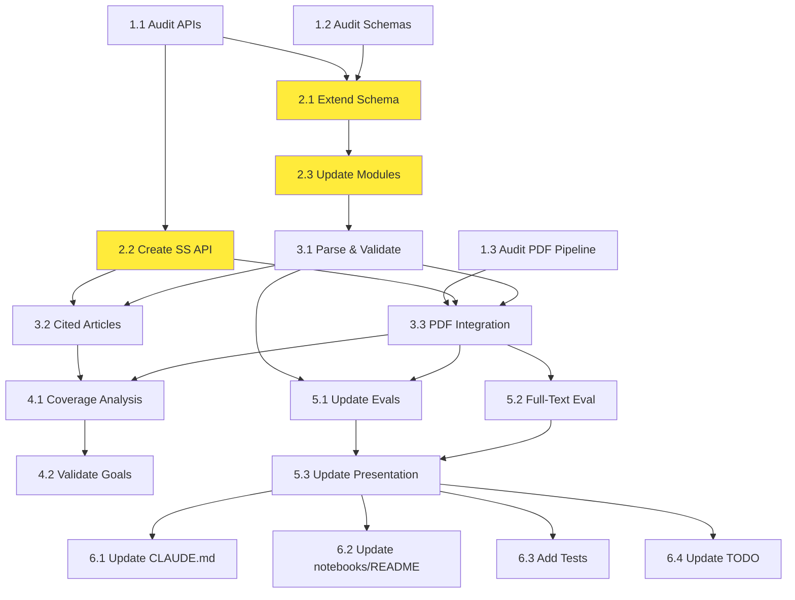

# Semantic Scholar Integration: Agent Execution Plan

> **Quick Start Guide for AI Agents**  
> **Context:** Execute tasks from `semantic_scholar_implementation_guide.md`  
> **Status:** Ready for execution

## 🎯 Quick Navigation

- **Full Implementation Guide:** [`semantic_scholar_implementation_guide.md`](./semantic_scholar_implementation_guide.md)
- **Original Task:** [`integrate_semantic_scholar.md`](./integrate_semantic_scholar.md)
- **Project Documentation:** [`../CLAUDE.md`](../CLAUDE.md)

---

## 📋 Execution Checklist

### ✅ Phase 1: COMPLETED
All audit tasks (1.1, 1.2, 1.3) completed during planning phase.

### ⏭️ Phase 2: Ready to Start

**Next Task: 2.1 - Extend Validation Schema**

```bash
# Agent command:
Use agent type: general-purpose
Task: Execute Task 2.1 from semantic_scholar_implementation_guide.md
Context: Add multi-source support to Pydantic schemas
```

**Agent Instructions:**
```
Read plans/semantic_scholar_implementation_guide.md, locate Task 2.1, and implement:
1. Add DataSource enum to schemas/validation.py
2. Add new fields to DatasetFeatures (source, source_url, journal_url, pdf_url, is_oa, cited_article_doi)
3. Update validators for new fields
4. Ensure backward compatibility
5. Add unit tests for new fields
```

---

## 🔄 Execution Workflow

### Current Priority: Phase 2 (Schema Refactoring)

**Task 2.1: Extend Validation Schema** ⚡ START HERE
- **Agent:** `general-purpose`
- **Inputs:** audit outputs, `schemas/validation.py`, `schemas/fuster_features.py`
- **Duration:** ~2 hours
- **Blocks:** Tasks 2.3, 3.1
- **Can run in parallel with:** Task 2.2

**Task 2.2: Create Semantic Scholar API Client**
- **Agent:** `general-purpose`
- **Inputs:** API audit, OpenAlex pattern reference
- **Duration:** ~3 hours
- **Blocks:** Tasks 3.2, 3.3
- **Can run in parallel with:** Task 2.1

**Task 2.3: Update Existing Modules**
- **Agent:** `general-purpose`
- **Inputs:** Updated schema from 2.1, `dryad.py`, `zenodo.py`
- **Duration:** ~2 hours
- **Blocks:** Task 3.1
- **Dependencies:** Task 2.1 must complete first

---

## 📊 Dependency Graph



**Legend:**
- 🟢 Green: Completed
- 🟡 Yellow: Ready to start (highlighted above)
- ⚪ White: Blocked by dependencies

---

## 🤖 Agent Assignment by Task

### Phase 2: Schema Refactoring
| Task | Agent Type | Complexity | Priority |
|------|-----------|------------|----------|
| 2.1 | `general-purpose` | Medium | 🔴 Critical |
| 2.2 | `general-purpose` | High | 🔴 Critical |
| 2.3 | `general-purpose` | Low | 🟡 High |

### Phase 3: Pipeline Integration
| Task | Agent Type | Complexity | Priority |
|------|-----------|------------|----------|
| 3.1 | `general-purpose` | Medium | 🔴 Critical |
| 3.2 | `general-purpose` | Medium | 🟡 High |
| 3.3 | `general-purpose` | Medium | 🟡 High |

### Phase 4: Coverage Analysis
| Task | Agent Type | Complexity | Priority |
|------|-----------|------------|----------|
| 4.1 | `task` or `general-purpose` | Low | 🟢 Medium |
| 4.2 | `explore` | Low | 🟢 Medium |

### Phase 5: Evaluation
| Task | Agent Type | Complexity | Priority |
|------|-----------|------------|----------|
| 5.1 | `general-purpose` | High | 🔴 Critical |
| 5.2 | `general-purpose` | High | 🟡 High |
| 5.3 | `explore` | Medium | 🔴 Critical (Presentation) |

### Phase 6: Documentation
| Task | Agent Type | Complexity | Priority |
|------|-----------|------------|----------|
| 6.1 | `explore` | Low | 🟢 Medium |
| 6.2 | `explore` | Low | 🟢 Medium |
| 6.3 | `general-purpose` | Medium | 🟡 High |
| 6.4 | `explore` | Low | 🟢 Low |

---

## ⚡ Parallel Execution Strategy

### Round 1 (Now)
```
Task 2.1 (general-purpose) || Task 2.2 (general-purpose)
```
Both can run simultaneously - no shared state

### Round 2 (After Round 1)
```
Task 2.3 (general-purpose) → depends on 2.1
```

### Round 3 (After Round 2)
```
Task 3.1 (general-purpose)
```

### Round 4 (After Round 3)
```
Task 3.2 (general-purpose) || Task 3.3 (general-purpose)
```
Both depend on 3.1, can run in parallel

### Round 5 (After Round 4)
```
Task 4.1 (task) || Task 5.1 (general-purpose) || Task 5.2 (general-purpose)
```
All depend on Phase 3, can run in parallel

### Round 6 (After Round 5)
```
Task 4.2 (explore) || Task 5.3 (explore)
```

### Round 7 (Final - After Round 6)
```
Task 6.1 (explore) || Task 6.2 (explore) || Task 6.3 (general-purpose) || Task 6.4 (explore)
```
All can run in parallel

---

## 📦 Expected Deliverables

### Code Changes
- [ ] `src/llm_metadata/schemas/validation.py` - Extended with multi-source fields
- [ ] `src/llm_metadata/schemas/fuster_features.py` - Updated if needed
- [ ] `src/llm_metadata/semantic_scholar.py` - New API client
- [ ] `src/llm_metadata/dryad.py` - Source tracking added
- [ ] `src/llm_metadata/zenodo.py` - Source tracking added
- [ ] `src/llm_metadata/article_retrieval.py` - Semantic Scholar support
- [ ] `src/llm_metadata/pdf_download.py` - Semantic Scholar PDF source
- [ ] `tests/test_semantic_scholar.py` - New test file

### Notebooks
- [ ] `notebooks/semantic_scholar_data_integration.ipynb` - Data parsing and validation
- [ ] Updated: `notebooks/fuster_test_extraction_evaluation.ipynb`
- [ ] Updated: `notebooks/fulltext_extraction_evaluation.ipynb`
- [ ] New/updated: Data coverage analysis notebook

### Data Files
- [ ] `data/dataset_092624_semantic_scholar_validated.xlsx`
- [ ] `data/semantic_scholar_cited_articles.csv`
- [ ] `notebooks/results/semantic_scholar_evaluation_[date]/`
- [ ] `notebooks/results/data_coverage_summary_[date]/`

### Documentation
- [ ] `CLAUDE.md` - Semantic Scholar integration documented
- [ ] `notebooks/README.md` - Lab log entries added
- [ ] `TODO.md` - Status updated
- [ ] `docs/results_presentation_20260219/work_plan.md` - Updated with results

---

## 🎯 Success Validation

After each phase, verify:

### Phase 2 ✓
- [ ] Schemas accept multi-source data
- [ ] Semantic Scholar API client works
- [ ] Existing modules add source field
- [ ] All tests pass
- [ ] No regressions

### Phase 3 ✓
- [ ] 254 Semantic Scholar records loaded
- [ ] Validation reports generated
- [ ] Cited articles retrieved
- [ ] PDF downloads integrated
- [ ] Success rates tracked

### Phase 4 ✓
- [ ] Coverage metrics computed for all sources
- [ ] Visualizations generated
- [ ] ≥80% abstract coverage confirmed (or gap documented)
- [ ] OA proportion analyzed

### Phase 5 ✓
- [ ] Abstract extraction runs on Semantic Scholar data
- [ ] Full-text extraction includes Semantic Scholar PDFs
- [ ] Evaluation reports generated
- [ ] Cross-source comparisons complete

### Phase 6 ✓
- [ ] Documentation comprehensive
- [ ] Lab logs updated
- [ ] Tests achieve ≥80% coverage
- [ ] TODO.md reflects current state

---

## 🚨 Risk Mitigation Checklist

Before starting each task:
- [ ] Read full task description in implementation guide
- [ ] Verify all input files exist
- [ ] Check for blockers/dependencies
- [ ] Understand acceptance criteria
- [ ] Plan rollback strategy if needed

During execution:
- [ ] Run tests frequently
- [ ] Commit incrementally
- [ ] Document assumptions
- [ ] Log errors and edge cases
- [ ] Update progress checklist

After completion:
- [ ] Verify all acceptance criteria met
- [ ] Run full test suite
- [ ] Update documentation
- [ ] Report progress with commit
- [ ] Note any issues for next agent

---

## 📞 Handoff Protocol

When completing a task:

1. **Mark task complete** in main PR description checklist
2. **Commit all changes** with descriptive message
3. **Document issues** encountered and solutions applied
4. **List unblocked tasks** now ready to start
5. **Suggest next priority** based on critical path

Example handoff message:
```
✅ Task 2.1 Complete: Extended validation schema

Changes:
- Added DataSource enum with DRYAD, ZENODO, SEMANTIC_SCHOLAR
- Added 6 new optional fields to DatasetFeatures
- Updated validators to handle None values
- Added 12 unit tests, all passing

Issues:
- HttpUrl validation required pydantic v2.0+ (already available)
- Decided to make all new fields optional for backward compatibility

Unblocked:
- Task 2.3 (Update Existing Modules) - depends on 2.1

Next Priority:
- Wait for Task 2.2 (API client) to complete, or start 2.3 now

Files changed:
- src/llm_metadata/schemas/validation.py
- tests/test_validation.py
```

---

## 🔍 Quick Reference

### Key File Locations
```
API Clients:        src/llm_metadata/{dryad,zenodo,openalex,semantic_scholar}.py
Schemas:            src/llm_metadata/schemas/{validation,fuster_features}.py
PDF Download:       src/llm_metadata/pdf_download.py
Notebooks:          notebooks/
Tests:              tests/
Documentation:      CLAUDE.md, notebooks/README.md, TODO.md
Data:               data/
```

### Important Commands
```bash
# Run tests
python -m pytest tests/

# Run specific test
python -m pytest tests/test_semantic_scholar.py -v

# Run notebooks (if needed)
jupyter lab --port=8888

# Check git status
git status
```

### Key Concepts
- **Multi-source architecture:** Track data source (Dryad/Zenodo/Semantic Scholar) for each record
- **Backward compatibility:** New fields must not break existing workflows
- **Conservative extraction:** LLM should only extract explicitly stated information
- **Validation-first:** Validate data against schemas before processing
- **Lab logging:** Document all experimental work in notebooks/README.md

---

## 📚 Additional Context

### Why Semantic Scholar?
The original Fuster et al. (2025) study used three data sources:
- **Dryad** (dataset repository)
- **Zenodo** (dataset repository)
- **Semantic Scholar** (academic search engine)

Current implementation only covers Dryad and Zenodo. Adding Semantic Scholar:
- Increases evaluation dataset size (254 additional records, 192 valid)
- Improves generalizability of results
- Enables cross-source performance comparison
- Provides access to cited articles for full-text analysis

### Coverage Goals
From `integrate_semantic_scholar.md`:
- **Abstract coverage:** ≥80% of valid records should have abstracts
- **PDF coverage:** ≥80% of valid records with PDFs should be open access
- **Rationale:** Enables comprehensive evaluation without manual data collection

### Presentation Context
Results needed by **Thursday 2026-02-19** for presentation. Priority items:
1. Data coverage metrics by source
2. Cross-source performance comparison
3. Updated evaluation reports
4. Source-specific insights

---

## ✅ Current Status

**Phase 1:** ✅ Complete (all audit tasks done during planning)  
**Phase 2:** ⏭️ Ready to start (Task 2.1 and 2.2 can run in parallel)  
**Phase 3:** ⏸️ Blocked (waiting for Phase 2)  
**Phase 4:** ⏸️ Blocked (waiting for Phase 3)  
**Phase 5:** ⏸️ Blocked (waiting for Phase 3)  
**Phase 6:** ⏸️ Blocked (waiting for Phase 5)  

**Next Action:** Execute Task 2.1 or 2.2 (or both in parallel)

---

## 💡 Tips for Success

1. **Read the full task** in `semantic_scholar_implementation_guide.md` before starting
2. **Follow existing patterns** - consistency is key
3. **Test incrementally** - don't wait until the end
4. **Document as you go** - future agents (and humans) will thank you
5. **Ask for clarification** - if acceptance criteria are unclear, note it
6. **Think defensively** - handle edge cases, validate inputs, check for None
7. **Commit frequently** - small, focused commits are easier to review
8. **Update progress** - use report_progress after meaningful work

---

**Ready to start?** 🚀

Choose one of these commands:
```bash
# Option 1: Start with schema refactoring (lower complexity)
Execute Task 2.1 from plans/semantic_scholar_implementation_guide.md

# Option 2: Start with API client (can run in parallel with 2.1)
Execute Task 2.2 from plans/semantic_scholar_implementation_guide.md

# Option 3: Do both in parallel (recommended)
Execute Tasks 2.1 and 2.2 in parallel using two agents
```
